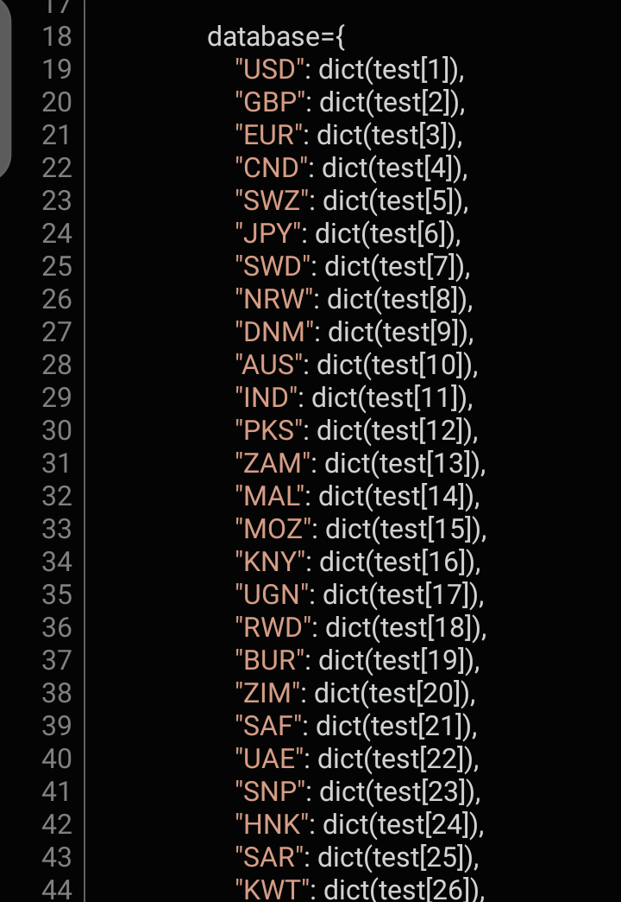
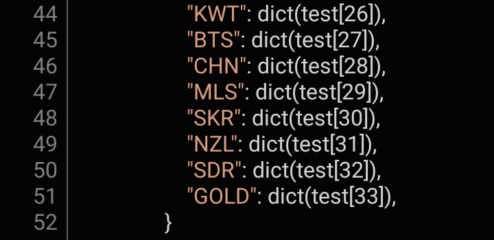

# currencyapi
The API for money exchange for Major currency in the world and I've add the TRA market currency.
+ Written in full python

# How to import?

      import currencyapi 

# How to access the currency pairs?
  ## To access the major currencies:
         currency= currency.major() 
 * This will return the following dictionary *

         currency= {
                   "EUR/USD": {"BUY": buying_price, "SELL": selling_price},
                   "USD/JPY": {"BUY": buying_price, "SELL": selling_price},
                   "GPD/USD": {"BUY": buying_price, "SELL": selling_price},
                   "USD/CHF": {"BUY": buying_price, "SELL": selling_price},
        }
   
  * E.g to access EUR/USD buying price

           currency=currency.major()
           pair=currency["EUR/USD"]["BUY"]
      

  ## To access the currency based in Tanzania:
            currency=currency.tra()
    
  * E.g The currency pairs for Tanzania country:
    

      
      
  
#### Developed by [Isack Philiph](https://twitter.com/isack_nkolima?t=-wwE7pD5wM0aCFGxEyalHw&s=09)
